
<h1 align="center">基于jsp的超市进货管理系统设计与实现</h1>

## 简介
超市进货管理系统：包括员工管理、商品类别管理、库存商品管理、进货订单管理、订单物流管理和通知公告管理等功能模块，实现高效的进货流程和库存管理。    --计算机毕业设计源码；毕设源码；java毕业设计源码

## 联系方式

<h3 align="center">获取完整代码与数据库文件 + 微信：deepguan QQ: 86050149 QQ群: 783742310</h3>

<h3 align="center">可帮忙远程部署 包运行成功！提供远程部署、修改代码、设计文档指导、代码讲解等服务！</h3>

## 功能介绍（完整见运行截图）
管理员：具备系统管理与维护的权限，包括员工管理和权限设置。能够管理商品类别、库存商品、进货订单和订单物流，监控库存状况，确保商品流通顺畅。负责公告发布和管理功能，实现对超市内部信息的有效传播。

员工：主要负责日常操作与商品管理。参与商品信息录入、库存盘点、订单处理和物流信息更新等工作。可以查看和编辑个人信息，确保业务流程的有效执行与协调。通过功能模块快捷导航提升管理效率。

供应商：通过供应商管理界面与超市进行商品进货合作。能够查看相关订单信息并提交物流信息，确保货品及时准确送达。支持批量导入功能，优化数据录入效率，确保供应链的高效运作。

用户：系统的最终使用者，面向超市顾客及内部员工。可通过导航菜单快速访问个人中心，查看个人信息、订单历史及公告。提供简洁明了的界面设计以提升用户体验，确保系统操作简单便捷。

## 运行截图
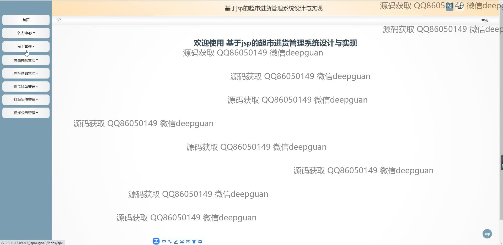
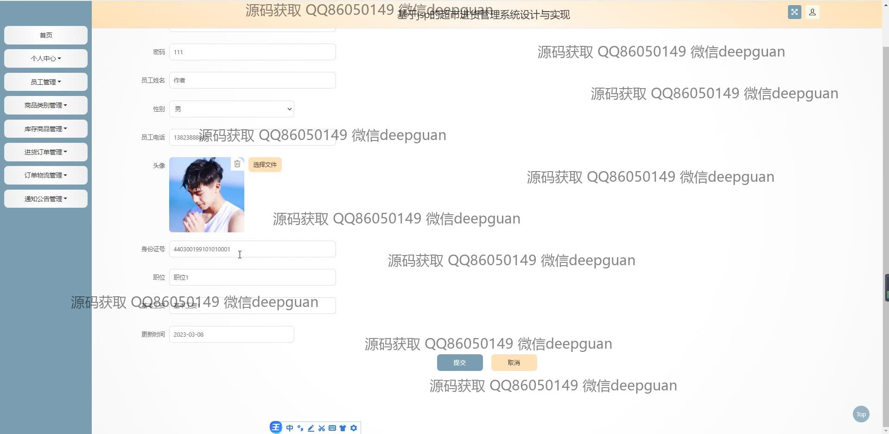
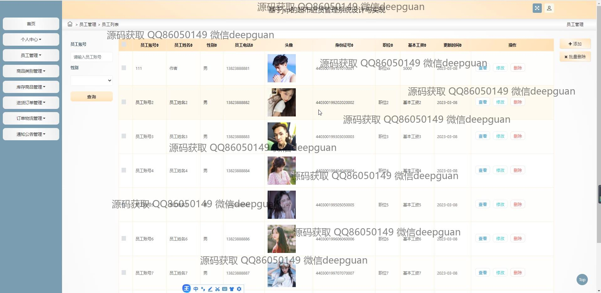
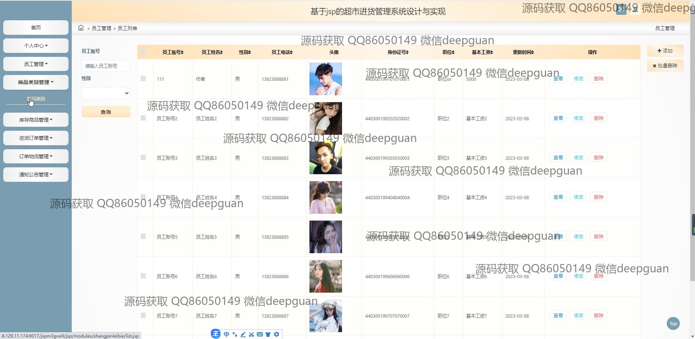
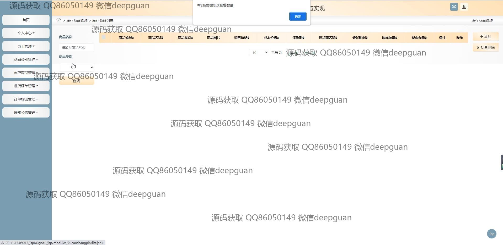
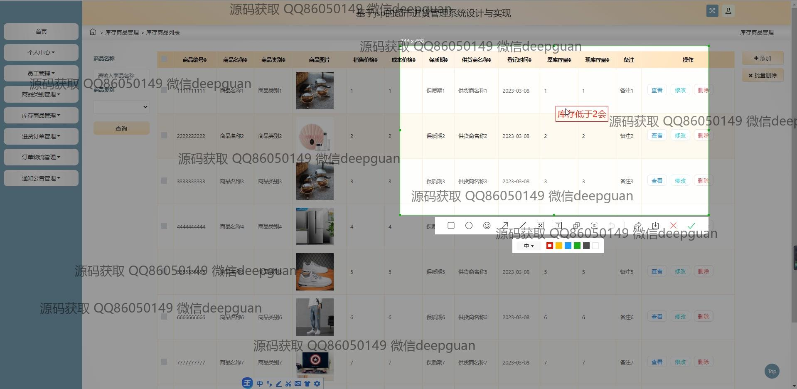
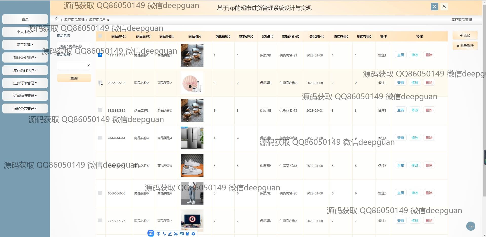
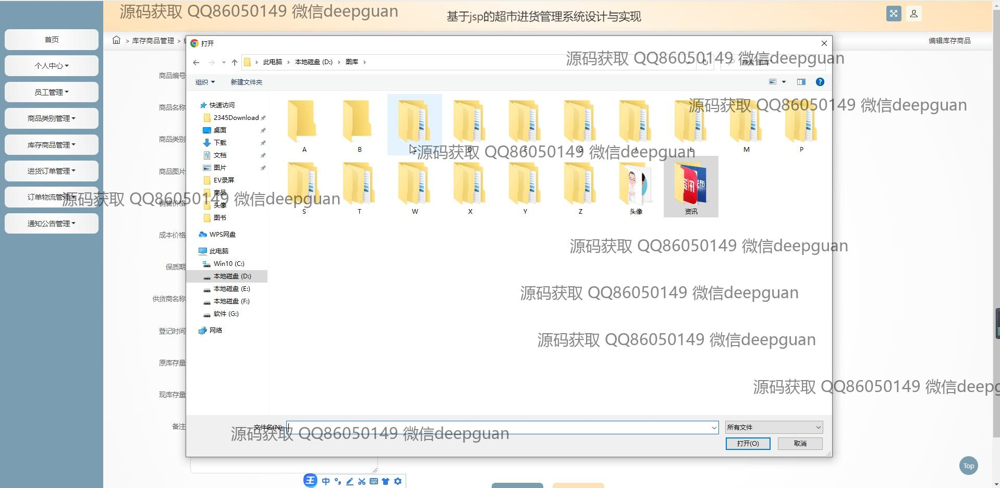
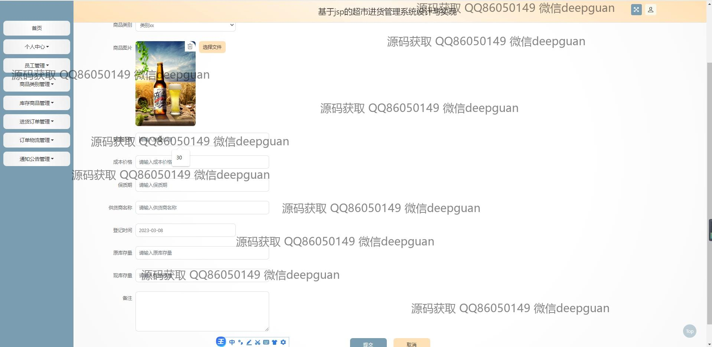
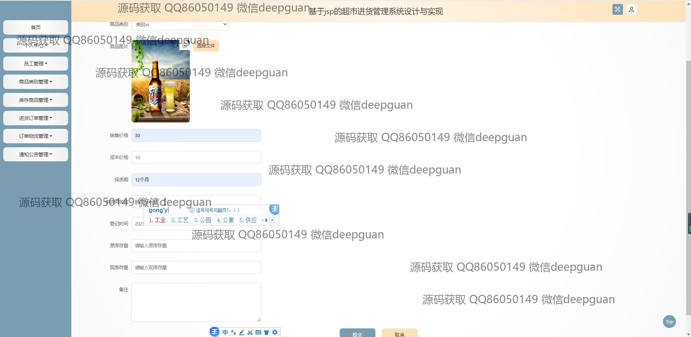
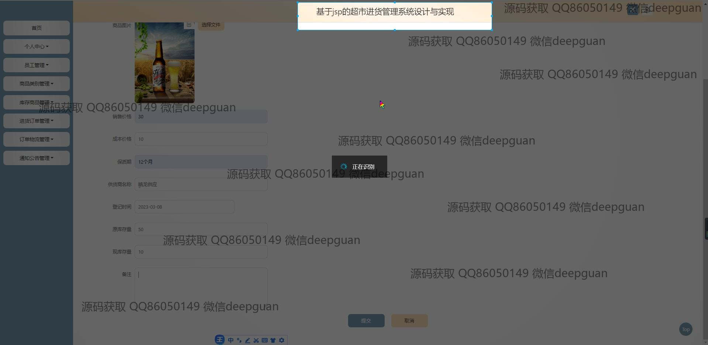
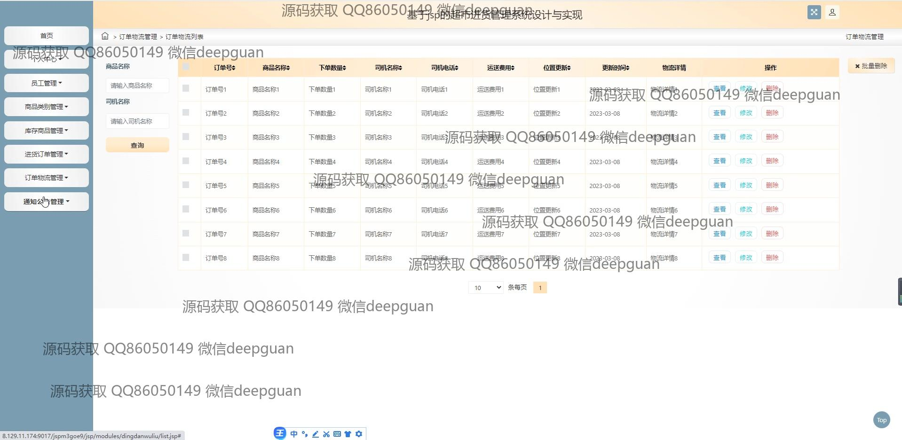
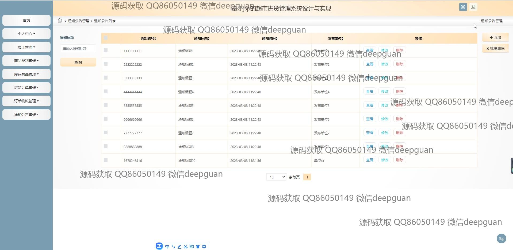
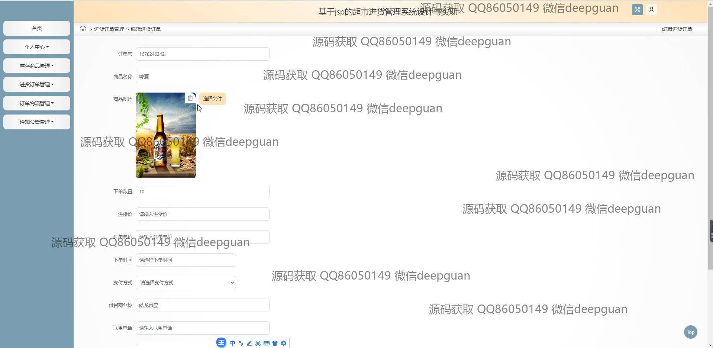
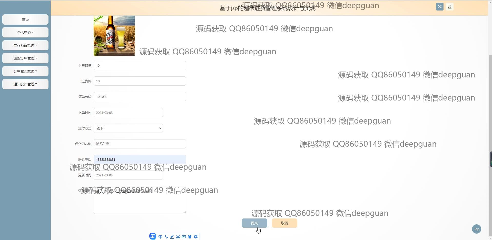
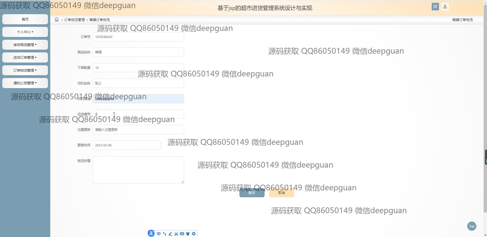
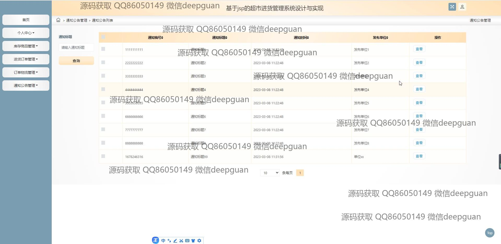
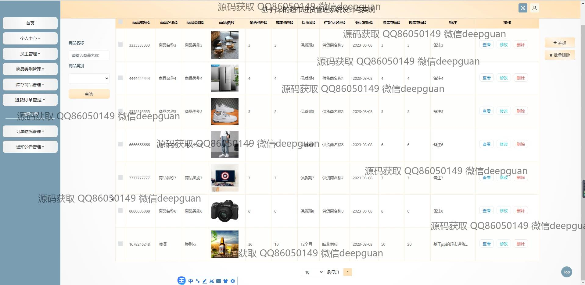

本代码来源于网络,仅供学习参考使用!

